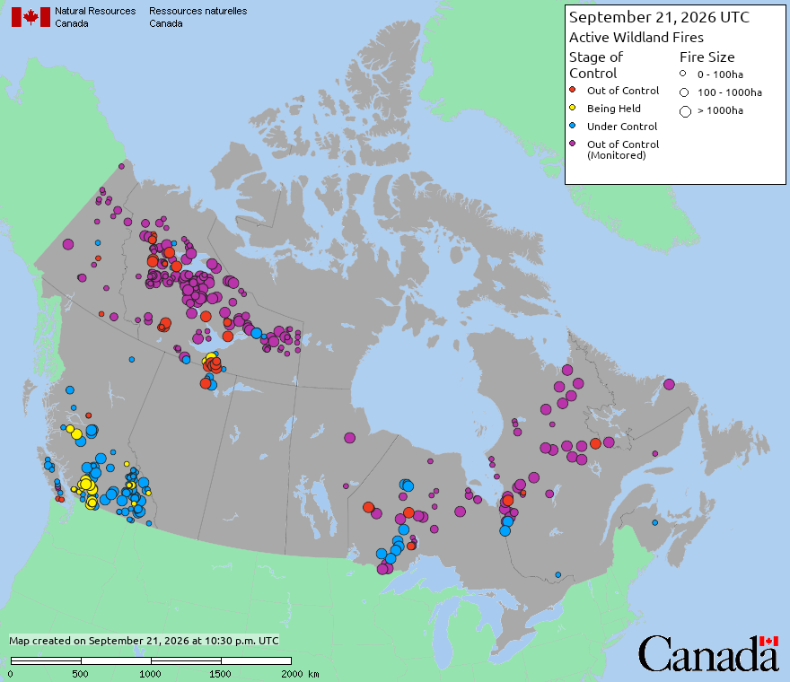
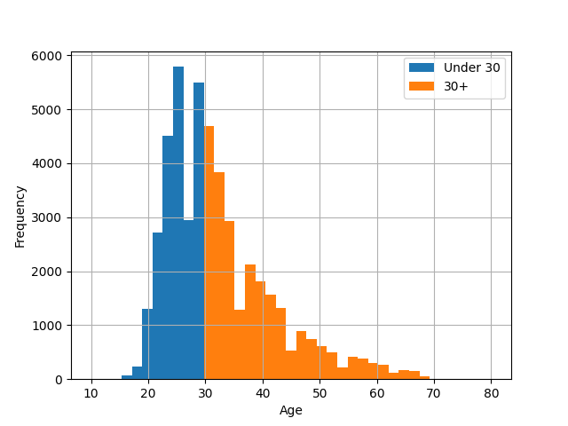

::: {.column-margin}

## Code

<ul>
<li><a href="" download> Demo Notebook</a></li>
<li><a href="" download> Demo Data</a></li>
</ul>

## Slides

- [\ PDF Slides](/slides/04-categorical.pdf)
- [\ HTML Slides](/slides/04-categorical.html)

:::

## <!--fit-->DATA 3464: Fundamentals of Data Processing
### <!--fit-->Categorical Data Basics

Charlotte Curtis
September 22, 2026

## Topic overview
- Exploring categorical data
- Basic categorical data encoding strategies
- Out of scope: Fancier encoding strategies, like feature hashing and target encoding

**Resources used:**
- [Feature Engineering Chapter 5](http://www.feat.engineering/encoding-categorical-predictors)
- [Scikit-learn User Guide (7.3)](https://scikit-learn.org/stable/modules/preprocessing.html#encoding-categorical-features)

## What is categorical data?
* Samples can take on one of several discrete values or groups
    - **Nominal**: no particular order to the groups
    - **Ordinal**: groups relate to each other in a specific order
* Categories can be represented as strings *or* numeric types
    - Domain knowledge is necessary!

    
> Let's take a few minutes to brainstorm some examples

## Exploring categorical data
<!-- _class: code_reminder -->

We've already done some of this, but some ideas to consider:
* `pandas.DataFrame.value_counts()` - how many of each category?
* Use category to group, then compute summary stats
* Plot color per category
* Scatter plot with jitter

## Representing categorical data
* To do math on categorical data, we need to map to numbers
* Consider:
    - Ordinal or nominal?
    - How many possible categories (cardinality)?
    - Any chance new ones might show up?

> How could we encode the examples?
> What are the benefits and drawbacks of each method?

## Ordinal encoding

<!-- _class: code_reminder -->

\

  | Category                    | Feature |
  | --------------------------- | ------- |
  | Under Control               | 0       |
  | Being Held                  | 1       |
  | *Out of Control (Monitored) | 2       |
  | Out of Control              | 3       |

* I am not a wildfire expert, this is my best guess at ordering

<footer>Image source: <a href="https://cwfis.cfs.nrcan.gc.ca/en/static-maps">Natural Resources Canada</a></footer>

<!-- 
Drawbacks
* Only useful for naturally ordered data
* Assumes linear relationship
* Difficult to deal with novel features
-->

## Nominal categories: one-hot encoding
<!-- _class: code_reminder -->
* Categories have no natural relationship
* Create $k$ new features from $k$ categories, very sparse matrix

| Animal |     | cat | dog | rabbit |
| ------ | --- | --- | --- | ------ |
| cat    | →   | 1   | 0   | 0      |
| dog    | →   | 0   | 1   | 0      |
| rabbit | →   | 0   | 0   | 1      |

<!-- 
Drawbacks
* Not good for high cardinality -> consider feature hashing or combining categories
* Collinearity issues -> (if a concern for model) dummy encoding instead with drop
* Novel features -> implied by 0 if not using dummy, could also define "other" category
-->

## From numbers to categories: discretization

\

* Sometimes numeric data is better represented as categorical
* Still needs encoding strategy
* Can introduce nonlinear relationships
* Like everything, contextual

## Advantages/disadvantages of various methods

### Ordinal

* Compact (1 column/feature)
* Only useful for naturally ordered data

* Imposes (linear) relationship
* Difficult to deal with novel categories

### One-hot

* No assumptions made about relationships
* Novel features implied by 0

* Memory intensive
* Not good for high cardinality
* Potential collinearity issues

## Coming up next
- Lecture: Basic numeric transformations
- Lab: Modelling with categorical data
- Assignment 1 due soon!

> [Feature Engineering Chapter 5](http://www.feat.engineering/encoding-categorical-predictors)
