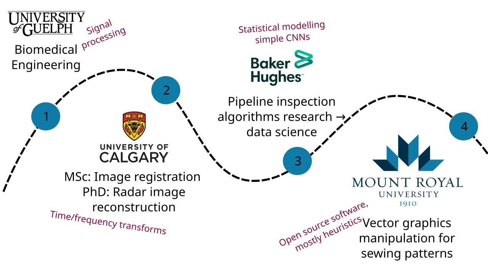
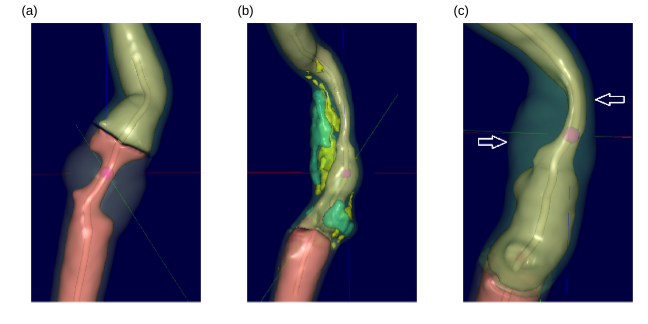

<!-- 
_class: title_slide
_paginate: skip
-->

# <!--fit-->DATA 3464: Fundamentals of Data Processing
### <!--fit-->Intro to the course

Charlotte Curtis
September 3, 2026

## Meet your instructor

**Name:** Charlotte Curtis

**Pronouns:** She/her

**Office:** B102-4

**Email:** ccurtis@mtroyal.ca

**Office hours:** [Book here](https://calendar.google.com/calendar/u/0/appointments/AcZssZ1DErlRJ8cNGFn27y-fiFzPEXgDKu8r7LXkGOY=)

## My Background

## Data processing
> This course introduces techniques for ethically and responsibly wrangling and manipulating datasets to make them appropriate for addressing the question at hand. Topics may include cleaning and transforming data, integrity and quality measures, common file formats, feature selection and engineering, and generating features from unstructured sources such as text and images.

Colloquially and lovingly referred to as **data wrangling**

## Grade Assessment

| Component          | Weight | Comment                      |
| ------------------ | ------ | ---------------------------- |
| Tutorial exercises | 10%    | Pass/fail                    |
| Assignments        | 35%    | 8/12/15 split                |
| Written tests      | 30%    | 2x15% each                   |
| Final exam         | 25%    | In lab with limited internet |

Bonus marks may be awarded for *substantial* corrections to materials, submitted as pull requests

**Source repo**: https://github.com/mru-data3464/f26

**Rendered at**: https://mru-data3464.github.io/f26

## Textbook(s)

- http://www.feat.engineering, additional open source resources as needed
- All the documentation!
    - [Pandas](https://pandas.pydata.org/docs/)
    - [Numpy](https://numpy.org/doc/stable/)
    - [SciPy](https://scipy.github.io/devdocs/)
    - [Scikit Learn](https://scikit-learn.org/stable/user_guide.html)
    - [Matplotlib](https://matplotlib.org/stable/users/index.html)

> Don't rely on AI summaries!

## Speaking of AI...
In this course (and others, and your career), you will need to know:
- **What** to do, and **why**
- **How** to do it

(also when and who) 

> Which of these things seem appropriate for AI assistance?

## Tentative weekly plan: Before reading week

| Week | Topic                                                  | Chapter (ish) |
| ---- | ------------------------------------------------------ | ------------- |
| 0-1  | Introduction and overview                              | 1-2           |
| 1-2  | Basic machine learning models and categorical encoding | 3, 5          |
| 2-3  | Exploring, splitting, and sampling data                | 4             |
| 4    | Basic numeric data transformations                     | 6             |
| 5    | Dealing with missing and weird data                    | 8             |

**Test 1 (15%): Thursday, Oct 7**

## Tentative weekly plan: second half

| Week | Topic                                         | Chapter (ish) |
| ---- | --------------------------------------------- | ------------- |
| 6    | Fancy numeric and categorical transformations | 5, 6          |
| 7    | Wrangling text                                |               |
| 9    | Bash scripting and data cards                 |               |
| 10   | 1D signals and audio                          |               |
| 11   | Images and videos (2D signals)                |               |
| 12   | Presentations and buffer time                 |               |

**Test 2 (15%): Tuesday, Dec 1**

## Core courses so far

## What do you know about...
- Various probability distributions
- Linear and logistic regression
- Data quality measures
- Data stewardship best practices
- Document parsing, web scraping, audio/video feature detection
- Linear algebra and array programming
- Prediction tasks: classification and regression
- Clustering and anomaly detection
- Evaluation metrics
- Basic data visualization (scatter plots, histograms, etc)

## What do you want to know about?

### Examples of Subject Matter
- Finance
- Real estate
- Transportation
- Climate
- Politics
- Biology
- Chemistry
- Malware

### Examples of Data types
- Unstructured text
- Structured text (e.g. csv, HTML)
- PDF
- Word documents
- Images
- Audio
- Video

## Case study: risk of ischemic stroke

Chapter 2: http://www.feat.engineering/stroke-tour

- Arterial stenosis can predict risk
- Plaque composition plays a role
- Features extracted from CT images
- Other risk factors (demographics, lifestyle) added to dataset

> Many decisions in the data analysis process are subjective - I will often make different decisions than the textbook

## From data to prediction

1. Understand the problem and define the task
2. Collect, anonymize and organize the data
3. Extract features
4. Explore the dataset
5. Select a model and preprocess
6. Train the model
7. Evaluate, fine-tune, iterate
8. Deploy and maintain your system

<footer>Adapted from Aurélien Géron's <a href="https://github.com/ageron/handson-mlp/blob/main/ml-project-checklist.md">ML Project Checklist</a></footer>

<!-- 
Note: these might be better at a later date

## Discussion questions
- When (and why) should we reserve a test set?
- Why are random number seeds useful?
- What is stratified sampling, and when should it be used?
- What does it mean for features to be correlated? -->

## Applied to the stroke example
1. What is the problem? What do we need to do?
2. (Collect, anonymize and organize the data) - Done for us
3. (Extract features) - Done for us
4. **Explore the dataset**
    - A critically important component, DO NOT OFFLOAD TO AI
    - This can even be where the data sciencing stops and we jump straight to visualizations and communicating insights!
    - Check out [Data for Good case studies](https://dataforgood.ca/case-studies/)

## 5. Select a model and preprocess

<footer>Source: <a href="https://scikit-learn.org/stable/machine_learning_map.html">scikit-learn documentation</a></footer>

<!-- 
_class: code_reminder
-->

## 7. Evaluate, fine-tune, and iterate
- In my example, I jumped straight to testing on the held-back test set
- This is a terrible idea! We have no confidence that the model actually worked. We could be:
    - overfitting to the training data
    - making incorrect assumptions about the data
    - applying inappropriate transformations, or missing some
    - using the wrong model altogether

> Validation needs to happen before the final testing

## Coming up next
- Lab: basic regression, show me where you're at
- Lecture: Simple models and evaluation metrics