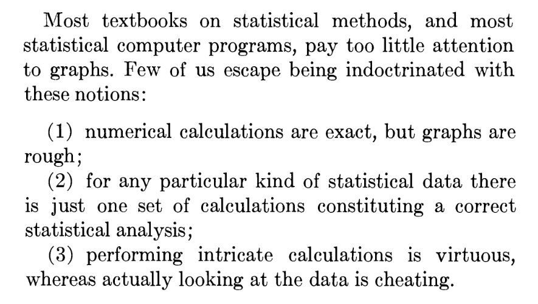

<!-- 
_class: title_slide
_paginate: skip
-->

# <!--fit-->DATA 3464: Fundamentals of Data Processing
### <!--fit-->Exploratory Data Analysis

Charlotte Curtis
September 17, 2026

## Topic overview

- Exploratory data analysis (EDA)
- Splitting your data

**Resources used**:
- [Feat.Engineering Chapter 3](http://www.feat.engineering/review-predictive-modeling-process)
- [R for Data Science (2e), Chapter 10](https://r4ds.hadley.nz/EDA.html)
- Hands on Machine Learning with Scikit-Learn and Tensorflow/PyTorch, Chapter 2. Available at [MRU Library](https://ebookcentral.proquest.com/lib/mtroyal-ebooks/detail.action?docID=30168989)

## Exploratory data analysis
The goal of EDA is to **Understand your data**

1) Ask questions (e.g. do my data fit the linear model assumptions?)
2) Look for answers (e.g. by making histograms)
3) Find more questions and return to step 1 (hmm, those are some weird numbers, what do these values represent?)

> EDA is not a formal process with a strict set of rules. More than anything, EDA is a state of mind. During the initial phases of EDA you should feel free to investigate every idea that occurs to you. Some of these ideas will pan out, and some will be dead ends. — Hadley Wickham

## Basic things to look at
* Data source - File? Database? API? 
* Structured/unstructured
* Assumption 1: relatively small (fits in memory) tabular dataset
  - Data types - numeric/categorical, text, other
* Assumption 2: numeric data 
    - Ranges
    - Summary statistics
    - Missing values
* Next week: categorical data, after reading week unstructured

## Example: Anscombe's Quartet
<!-- _class: code_reminder -->
* Very small dataset, constructed by hand in 1973 by [Francis Anscombe](https://www.jstor.org/stable/2682899?seq=1)

* Not known exactly how he made it, but Drs. Roberta La Haye and Peter Zizler proposed a [compelling argument](https://www.tandfonline.com/doi/full/10.1080/07468342.2024.2385078) for linear algebra

## Case Study: Data visualization to the rescue
* A [2012 study about honesty](https://www.pnas.org/doi/full/10.1073/pnas.1209746109) reported that "Signing at the beginning makes ethics salient and decreases dishonest self-reports in comparison to signing at the end"
* In 2020, the authors published a new paper admitting that their original results [could not be replicated](https://www.pnas.org/doi/abs/10.1073/pnas.1911695117), and noticed an anomaly in the **summary statistics**
* The 2020 paper also published the original data, which was downloaded and visualized by a team of anonymous researchers working with [Data Colada](https://datacolada.org/98)
* This led to the 2012 paper being retracted, a [$25M lawsuit](https://datacolada.org/116), a [data-driven defense](https://datacolada.org/118)

> Moral of the story is, look at your data!

## Useful starting points
<!-- _class: code_reminder -->

Assuming your data is small enough and well structured:

* [`pandas.DataFrame.info`](https://pandas.pydata.org/pandas-docs/stable/reference/api/pandas.DataFrame.info.html): data type, number of non-null, names, dimensions
* [`pandas.DataFrame.head`](https://pandas.pydata.org/pandas-docs/stable/reference/api/pandas.DataFrame.head.html): return the first `n` rows (default 5). Also `tail`.
* [`pandas.DataFrame.describe`](https://pandas.pydata.org/pandas-docs/stable/reference/api/pandas.DataFrame.describe.html): Compute a bunch of summary statistics
* Various [aggregation statistics](https://pandas.pydata.org/docs/getting_started/intro_tutorials/06_calculate_statistics.html)

> Next up, visualize!

## Types of exploratory visualizations
* I will not provide an exhaustive list of visualizations!
* Pandas provides a [handy wrapper](https://pandas.pydata.org/pandas-docs/stable/user_guide/visualization.html) around [matplotlib](https://matplotlib.org/)
* So does [Seaborn](https://seaborn.pydata.org/) - check out the [example gallery](https://seaborn.pydata.org/examples/index.html)
* Some of my favourites:
  - Histograms
  - Scatter plots/hexbin plots
  - Box plots/violin plots
* But before we get too deep into EDA, it's time to **split your data**

## Why split your data?

* We need to set aside a final **test set** to evaluate our final model
* Humans are great at detecting patterns!
* Even looking at test data could influence decisions, causing **data leakage**

<footer>Image source: <a href="https://tylervigen.com/spurious-correlations">Spurious Correlations</a></footer>

## When to split your data

<!-- _class: code_reminder -->

How much EDA should you do before splitting? You might need to know:

* Are there any missing values?
* Is there a need for [stratified sampling](http://www.feat.engineering/data-splitting)?
* Do the data have a unique identifier beyond the row label?
* As soon as you have a general sense of the:
  - Data types
  - Missing features
  - Distributions, particularly categorical
* It's time to split the data!

## How to split your data
As usual, it depends on the:

* Data set size $n$
* Relationship between number of predictors $p$ and $n$
* Nature of the data:
  - Time series?
  - Stratification needed?
* Intended **validation approach**

## Validation

* We also need **validation** data
* If the dataset is sufficiently large, this can be a separate split
* In lab 2 and assignment 1 I asked you to use **cross-validation**

<footer>Image source: <a href="https://scikit-learn.org/stable/modules/cross_validation.html">Scikit-learn</a></footer>

## Validation

* Validation data is used to make decisions about your model, e.g.
  - Model selection
  - Tuning hyperparameters
  - Monitor training progress
* However, validation data is not used to directly *train* a model
* Think of it like a test-adjacent set where you can repeatedly try stuff on your training set, then evaluate on validation

> Cross-validation is a way of checking your model choice and parameters, but final training should be done on the entire training set

## Coming up next

- Assignment 1
- Basic categorical data
  - Exploring
  - Encoding strategies

> [Feature Engineering Chapter 5](http://www.feat.engineering/encoding-categorical-predictors)
