<!-- 
_class: title_slide
_paginate: skip
-->

## <!--fit-->DATA 3464: Fundamentals of Data Processing
### <!--fit-->Splitting and combining data

Charlotte Curtis
September 23, 2026

## Topic overview
Adding detail to the process thus far
- Splitting and sampling data
- Some more visualization tricks
- Combining multiple datasets

**Resources used:**
- [Feature Engineering Sections 3.3-3.4](https://feat.engineering/03-Review_of_the_Modeling_Process.html#sec-data-splitting)
- Hands on Machine Learning with Scikit-Learn and Tensorflow/PyTorch, Chapter 2. Available at [MRU Library](https://ebookcentral.proquest.com/lib/mtroyal-ebooks/detail.action?docID=30168989)

## The data process to date

* We've talked about *why* to split, but not *how*
* We might also have more than one table to deal with

## How to split your data

* Simple scenario: random sample (typically 70-80% for training)
* **Only works if:**
    - Stratification doesn't matter
    - Data is guaranteed not to change
    - Data is not a time-series

> How do we know if stratification is necessary?

## Sampling bias
Stratification is used to mitigate **sampling bias**

* Cilantro example: assume 80% of population likes cilantro
* Goal: ensure our sample is representative of the population, $\pm 5\%$

The [binomial distribution](https://en.wikipedia.org/wiki/Binomial_distribution) can be used to model the probability of choosing $k$ people who like cilantro from $n$ total participants:

$$P(X = k) = \binom{n}{k}p^k(1-p)^{n-k}, \mathrm{where} \binom{n}{k} = \frac{n!}{k!(n-k)!}$$

## Sampling bias continued

<!--
  _class: code_reminder 
-->

$P(X = k)$ is the probability mass function, and the corresponding cumulative distribution function is just the sum up to $k$:

$$P(X \leq k) = \sum_{i=0}^k \binom{n}{i}p^i(1-p)^{n-i}$$

Suppose we **randomly** sample 100 people. What is the probability of fewer than 75 or more than 85 cilantro lovers?

> Here we've defined an "unbiased sample" as being $\pm5\%$

## Stratification approach
* The need for stratification depends on sample size, distribution of stratification category, and how much bias you're willing to accept
  
  |                    | Small Sample Size | Large Sample Size |
  | ------------------ | ----------------- | ----------------- |
  | Unbalanced Classes | Stratify          | Maybe             |
  | Balanced Classes   | Maybe             | Not necessary     |

* Stratification categories can be the target variable, or a predictor
* Goal is to have the same class distribution in both testing and training

## Repeatable randomness
<!-- _class: code_reminder -->

* At minimum, you should **always set a random seed** so that every time you sample your data it is the same "random sample"
* This isn't enough if your data might get updated! You can:
  - Store the IDs of your split offline, then sample any new data and append to them (ensuring that test/train never mix)
  - Get fancy with a deterministic method like hashing features to create unique IDs, then thresholding based on maximum possible value

> As usual, we want to avoid **data leakage**

## Back to visualizations
Now that we've got a test set safely stashed, we can **ask questions** about the data and use visualizations and statistics to answer them. Some examples:
* Do any of my features seem to be related to my target?
* Do any of my features seem to be related to each other?
* Why are some values more common than others?
* Do these values make sense in the context of my **domain knowledge**?
* If I group my data together in some way, are there clear trends?

<footer><a href="https://r4ds.hadley.nz/EDA.html#questions">R for Data Science</a> has some good examples of further questions</footer>

## Some handy tricks
<!-- _class: code_reminder -->
A few things to tweak that can make visualizations easier to read:

* Histogram bin sizes
  - Aiming for a smooth distribution that works for your data
* Transparency (`alpha`)
  - Useful for both dense scatter plots and overlapping categories
* "Jitter"
  - Mostly for scatter plot of continuous vs categorical data
  - Add a tiny bit of random noise to spread out samples

## Combining data sources
<!-- _class: code_reminder -->
My assumption: you know all about joins from DATA 2721 and DATA 2402

* Concatenating tables: `pd.concat([list, of, dataframes], axis=??)`
* Joining to *nearest* match: `pd.asof`
* Watch out for datatypes! Dates in particular are a huge pain
  - `datetime[ns]` is not the same as `datetime[s]`

## Coming up next
- No lab this week (Truth and Reconciliation)
- Assignment 1 is due!
- Next topic: Missing data and outliers
- Written test 1 next **Thursday**